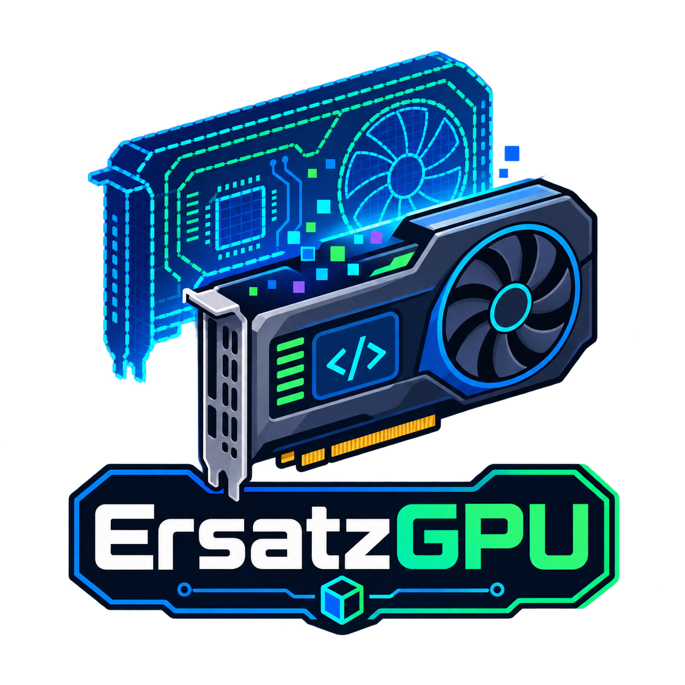

[](https://github.com/devops-dojo7/ErsatzGPU/actions/workflows/ci.yml)
[](/LICENSE)

# ErsatzGPU

**Learn how a real GPU datacenter actually works, with zero GPUs.**

ErsatzGPU simulates the math (VRAM, KV cache, topology, cost), the
Kubernetes scheduling (fake GPU device-plugins, MIG, a 100+ node
KWOK-simulated fleet), and the observability stack (Grafana, Prometheus,
Langfuse) of a frontier-lab-scale GPU cluster — so anyone can learn
distributed training/inference internals and GPU-datacenter operations on a
laptop, no hardware or cloud bill required.

## Why this project

GPU scarcity is the single biggest barrier to actually learning how large
model training and inference work. You can read papers about NVLink
topology, KV-cache growth, or disaggregated prefill/decode serving, but
without real GPUs you can't *feel* any of it: what an out-of-memory error
looks like at 80GB, why tensor parallelism needs NVLink, why a prefill
burst spikes decode latency on a colocated GPU pool, or what it's like to
watch a fleet of nodes register in Kubernetes and schedule workloads
against them.

ErsatzGPU closes that gap. Every number is computed from the same formulas
that govern real hardware — not hardcoded or looked up — so the simulator
responds correctly to input changes (bigger model, different GPU, more
nodes) the same way a real cluster would. The K8s layer schedules real
pods against real (fake) GPU resources, and the observability stack is a
real Grafana/Prometheus/Langfuse deployment, not a mockup — only the GPUs
themselves are ersatz.

## Use case

- **Learning GPU internals**: VRAM breakdown (weights/gradients/optimizer
  states/activations/KV-cache), architecture variants (GQA, MoE, MLA),
  NVLink/InfiniBand topology bandwidth, and training cost/power modeling —
  all interactive, in a browser.
- **Learning inference serving**: prefill (compute-bound TTFT) vs. decode
  (memory-bandwidth-bound TPOT), prefix-cache-hit routing, vLLM
  PagedAttention, speculative decoding, and [llm-d](https://llm-d.ai/)-style
  disaggregated colocated-vs-separate-pool serving tradeoffs.
- **Practicing Kubernetes GPU scheduling** without hardware: watch pods get
  scheduled against fake `nvidia.com/gpu`/`simgpu.dev/gpu` resources,
  including MIG partitioning and a 100+ node simulated fleet.
- **Prototyping an observability stack**: a real Grafana + Prometheus +
  Langfuse deployment (docker-compose or in-cluster) fed by simulated GPU
  workloads, for practicing dashboard-building or LLM request tracing
  without needing a live training job to generate data.
- **CI/CD patterns for GPU-scheduled workloads**: a reusable GitHub Actions
  workflow that deploys the whole stack to a real k3d cluster and asserts
  GPU scheduling + a training run + a real inference round trip all work —
  copyable into any repo that needs to test against GPU-scheduled K8s
  workloads.

## How it works

```text
engine/  (pure-Python VRAM/KV-cache/topology/cost/inference formulas)
   │
api/     (FastAPI service — wraps engine/, streams inference over SSE,
   │       optional Grafana/Langfuse push, launches real k8s Jobs)
   │
web/     (Next.js site — model/GPU pickers, live training panel,
   │       prompt playgrounds, GPU-monitoring sparklines)
   │
k3s/     (fake-GPU K8s layer — device-plugin or fake-gpu-operator backend,
           Helm chart, sample trainer Job, real inference server)
```

`engine/` has zero web or Kubernetes dependencies — every formula is
independently testable and is the single source of truth the API, the
K3s trainer Job, and the real inference server all call into, so the
website's numbers and a real scheduled pod's simulated behavior never
drift apart.

### Quick start

```bash
python3 -m venv .venv
.venv/bin/pip install -r requirements.txt
.venv/bin/pytest tests/ -v
.venv/bin/uvicorn api.main:app --reload

cd web
npm install
npm run dev
```

API docs: http://localhost:8000/docs · Website: http://localhost:3000

### Deploy the fake-GPU K8s layer

Verified against a local [k3d](https://k3d.io) cluster:

```bash
# build the images
docker build -t simgpu/device-plugin:dev -f k3s/device-plugin/Dockerfile k3s/device-plugin
docker build -t simgpu/api:dev -f api/Dockerfile .
docker build -t simgpu/trainer:dev -f k3s/trainer/Dockerfile .
docker build -t simgpu/inference-server:dev -f k3s/inference-server/Dockerfile .
docker build -t simgpu/web:dev web

# spin up a cluster and load the images
k3d cluster create simgpu --agents 2 --wait
k3d image import simgpu/device-plugin:dev simgpu/api:dev simgpu/trainer:dev simgpu/inference-server:dev simgpu/web:dev -c simgpu

# deploy
helm install simgpu k3s/helm/simgpu

# see the simulated GPU resources show up on every node
kubectl describe nodes | grep -A5 simgpu.dev/gpu

# watch the sample trainer job get scheduled and simulate training steps
kubectl logs -f job/simgpu-trainer

# reach the API / website
kubectl port-forward svc/simgpu-api 8000:8000
kubectl port-forward svc/simgpu-web 3000:3000
```

Change `values.yaml` (`trainer.topologyShape`, `trainer.gpuModel`,
`trainer.fabricId`, `devicePlugin.gpuCount`, etc.) and `helm upgrade` to see
step time and communication overhead change with the simulated topology.
Tear down with `k3d cluster delete simgpu`.

### Datacenter mode: fake-gpu-operator + a 100+ node fleet

The default `gpuBackend: simgpu` above is a minimal fake device-plugin —
real k8s GPU-resource scheduling, but one static GPU model/count per node.
For MIG partitioning, Dynamic Resource Allocation (DRA), and its own
Prometheus GPU-utilization metrics, point this chart at
[run-ai/fake-gpu-operator](https://github.com/run-ai/fake-gpu-operator)
instead:

```bash
# label nodes before installing — status-updater only reacts to
# already-labeled nodes
kubectl label node k3d-simgpu-agent-0 k3d-simgpu-agent-1 k3d-simgpu-server-0 \
  run.ai/simulated-gpu-node-pool=default

helm upgrade -i fake-gpu-operator oci://ghcr.io/run-ai/fake-gpu-operator/fake-gpu-operator \
  --namespace fake-gpu-operator --create-namespace --version 0.2.0 \
  --set topology.nodePools.default.gpuProduct=H100-SXM5-80GB \
  --set topology.nodePools.default.gpuCount=8 \
  --set topology.nodePools.default.gpuMemory=81920 \
  --set runtimeClass.enabled=false

kubectl delete job simgpu-trainer --ignore-not-found
helm upgrade simgpu k3s/helm/simgpu --set gpuBackend=fake-gpu-operator
```

Then, for a KWOK-simulated fleet of 100+ nodes (scheduling/topology-at-scale
only — KWOK nodes have no real kubelet, so real trainer/inference Jobs
still land on the small real node pool above):

```bash
KWOK_VERSION=v0.7.0
kubectl apply -f "https://github.com/kubernetes-sigs/kwok/releases/download/${KWOK_VERSION}/kwok.yaml"
kubectl apply -f "https://github.com/kubernetes-sigs/kwok/releases/download/${KWOK_VERSION}/stage-fast.yaml"

helm upgrade fake-gpu-operator oci://ghcr.io/run-ai/fake-gpu-operator/fake-gpu-operator \
  --namespace fake-gpu-operator --reuse-values --version 0.2.0 \
  --set kwokGpuDevicePlugin.enabled=true

helm upgrade simgpu k3s/helm/simgpu \
  --set gpuBackend=fake-gpu-operator --set fleet.enabled=true --set fleet.numNodes=100

kubectl get nodes -l type=kwok
```

## Observability and WebUI

### WebUI

The Next.js site is tabbed into **Training** (model/GPU pickers, VRAM
breakdown, topology diagram, cost calculator, a live training panel fed by
the K3s trainer Job or an in-process simulated run) and **Inference**
(prefill/decode explainer, well-lit-path presets, a colocated-vs-
disaggregated throughput comparison, a live single-prompt playground with
streaming TTFT/tokens-per-sec, and a multi-request playground for
continuous-batching behavior). Both tabs include a "GPU monitoring
(simulated)" section — live sparkline charts for power draw, SM
utilization, and memory-bus-busy %.

### Observability stack

A real Grafana + Prometheus + Langfuse deployment, runnable via
docker-compose (no cluster needed) or in-cluster:

```bash
docker compose up                                             # simulator only: api :8000, web :3000
docker compose --profile observability up                     # + prometheus :9090, grafana :3001
docker compose --profile langfuse up                          # + langfuse :3002 and its storage stack
docker compose --profile observability --profile langfuse up  # everything
```

Grafana comes pre-provisioned with two dashboards: this project's own
(`k3s/grafana/dashboard.json`) and a vendored community
[NVIDIA DCGM dashboard](https://grafana.com/grafana/dashboards/23382-nvidia-mig-dcgm/)
— the API emits real `DCGM_FI_*` metric names/labels so the standard
community dashboard renders simulator data unmodified. Regenerate the
resolved copies with `./scripts/generate-provisioned-dashboards.sh` after
editing either vendored dashboard JSON.

In-cluster, this project layers a `ServiceMonitor` and dashboard
`ConfigMap` on top of `kube-prometheus-stack` and Langfuse's official Helm
chart rather than reimplementing either:

```bash
helm install kube-prometheus-stack prometheus-community/kube-prometheus-stack --namespace monitoring --create-namespace
helm install langfuse langfuse/langfuse --namespace langfuse --create-namespace
helm upgrade simgpu k3s/helm/simgpu --set observability.enabled=true
```

**Langfuse request tracing**: `POST /inference/stream` (SSE) is what makes
the website's playgrounds send real prompt/timing data to the backend at
all — each completed request emits a Langfuse trace with `prefill` and
`decode` spans. A real, long-running `k3s/inference-server`
(OpenAI-Completions-shaped `/v1/completions`, launched on demand via
`POST /inference/launch-k8s-server`) lets a real client — `curl`, the
`openai` SDK — produce real Langfuse traces against the mock cluster too:

```bash
helm upgrade simgpu k3s/helm/simgpu \
  --set langfuse.enabled=true \
  --set-string langfuse.publicKey=pk-lf-... \
  --set-string langfuse.secretKey=sk-lf-...
```

**Optional real Grafana Cloud integration** (`api/grafana_push.py`, off by
default): posts real start/finish annotations and pushes live
power/step/token gauges via Prometheus remote-write:

```bash
helm upgrade simgpu k3s/helm/simgpu \
  --set grafana.enabled=true \
  --set-string grafana.url=https://yourorg.grafana.net \
  --set-string grafana.apiKey=glsa_... \
  --set-string grafana.remoteWriteUrl=https://prometheus-prod-XX-.../api/prom/push \
  --set-string grafana.promUsername=123456 \
  --set-string grafana.promToken=glc_...
```

Every optional integration (Grafana Cloud, Langfuse) is a no-op when
unconfigured, and real credentials are always passed via `--set-string` at
deploy time — never committed to `values.yaml`.

## Ecosystem integrations

| Project | What the integration enables |
| --- | --- |
| [llm-d](https://llm-d.ai/) | The disaggregated prefill/decode serving model `engine/inference.py` and the Inference tab are built on |
| [run-ai/fake-gpu-operator](https://github.com/run-ai/fake-gpu-operator) | Opt-in richer GPU backend — MIG, DRA, its own Prometheus metrics, KWOK-simulated fleets |
| [KWOK](https://kwok.sigs.k8s.io/) | Backs the 100+ node simulated fleet with no real kubelet required |
| [Prometheus](https://prometheus.io/) | Scrapes `GET /metrics` (standard exposition format, including real `DCGM_FI_*` series) |
| [Grafana](https://grafana.com/) | Pre-provisioned dashboards, locally or via `kube-prometheus-stack`'s sidecar |
| [Langfuse](https://langfuse.com/) | Per-request LLM tracing (prefill/decode spans) for both simulated playground requests and real workloads against the mock cluster |
| [Kubernetes](https://kubernetes.io/) / [Helm](https://helm.sh/) | The whole `k3s/` layer — device-plugin, trainer, inference-server, and the `simgpu` chart |
| [GitHub Actions](https://github.com/features/actions) | `simgpu-e2e-reusable.yml` — a reusable workflow other repos can call directly to test against a real k3d-deployed mock GPU cluster (see `ci-templates/README.md`) |

## Roadmap, and contributing

Live status board: [ErsatzGPU Roadmap](https://github.com/orgs/devops-dojo7/projects/1).

Built and verified so far: the calculation engine and FastAPI service;
the Next.js site; the K3s fake-GPU device-plugin layer; the llm-d-style
inference simulator; architecture-aware model formulas (GQA/MoE/MLA);
tensor/pipeline parallelism and power modeling; speculative decoding and a
Prometheus metrics bridge; optional real Grafana Cloud push; and the
mock-datacenter platform expansion — fake-gpu-operator, a KWOK-simulated
fleet, a full Grafana/Prometheus/Langfuse observability stack, real
per-request inference streaming and tracing, and a reusable CI/CD e2e
workflow.

Ahead: broader accelerator-vendor coverage in the topology model, deeper
MIG-aware capacity planning, and expanding the CI template library beyond
the single reusable e2e workflow.

Contributions are welcome — see [CONTRIBUTING.md](CONTRIBUTING.md) for
local dev setup, the pre-PR check commands, and the conventions used
throughout this repo (the `enabled:`-flag Helm pattern, the
optional-integration shape, etc.).

## License

[MIT](LICENSE). Vendored third-party content — the community NVIDIA DCGM
Grafana dashboard and Langfuse's self-host docker-compose — keeps its own
upstream license; see the source comments in
`scripts/generate-provisioned-dashboards.sh` and
`k3s/observability/langfuse/docker-compose.langfuse.yml` for provenance.
